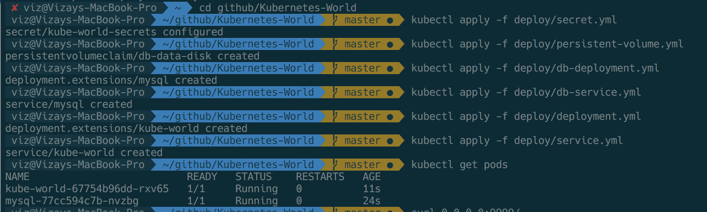
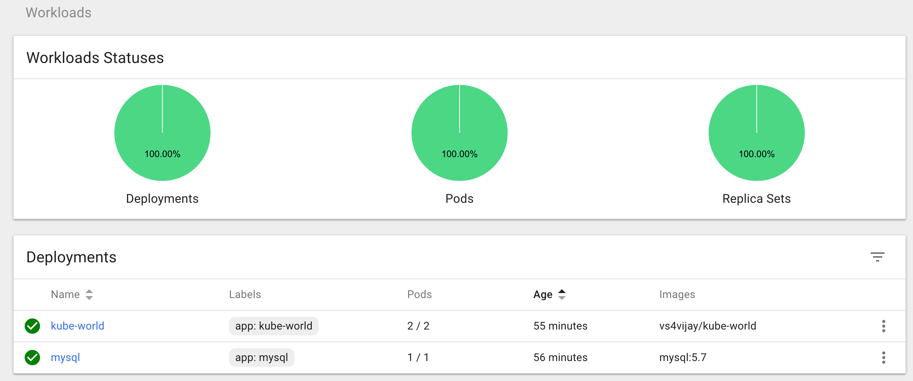
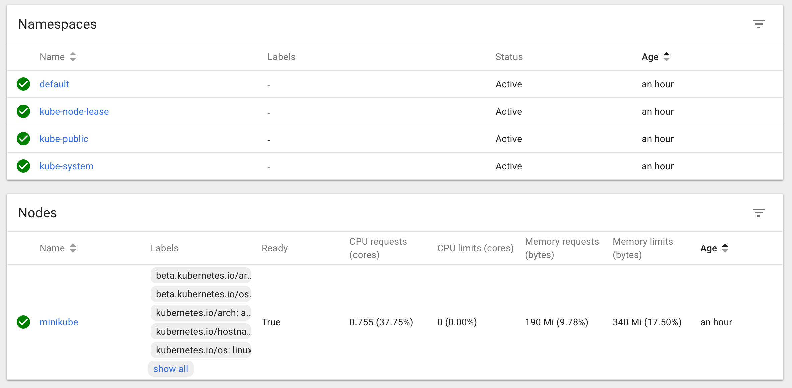

# Kubernetes World

An application to try out end-to-end Kubernetes flow and deployment, This includes Docker, NodeJS, Express, MySQL, Kubernetes.


## Running

### Run without Docker

- `npm install`
- `node app.js`
- `nodemon app.js`

### Run with Docker

- `docker build -t kube-world .`
- `docker run -p 9999:9999 kube-world`

### Run with Kubernetes

- `brew install kubernetes-cli`
- `brew cask install minikube`
- `minikube start`
---


## Push image to registry
- `docker build -t vs4vijay/kube-world .`
- `docker login`
- `docker push vs4vijay/kube-world`
---


## Kubernetes Deployment

```
kubectl apply -f deploy/secret.yml

kubectl create -f deploy/persistent-volume.yml

kubectl create -f deploy/db-deployment.yml
kubectl create -f deploy/db-service.yml

kubectl create -f deploy/service.yml
kubectl create -f deploy/deployment.yml

kubectl get pods

minikube ssh

OR

kubectl run kube-world --replicas=1 --labels="run=kube-world" --image=vs4vijay/kube-world --port=9999


```
---


## Screenshots






---


## Create DB User

```
CREATE DATABASE viz_db;

CREATE USER 'viz'@'%' IDENTIFIED WITH mysql_native_password BY '123456';

GRANT ALL PRIVILEGES ON viz_db.* TO 'viz'@'%';

FLUSH PRIVILEGES;
```
---


## To Do

- [x] Basic Node + Express + DB App
- [x] Dockerize
- [ ] Run as non-root user
  - [ ] Multistage Build
- [x] Kubernetes
  - [x] Have MySQL
  - [x] Configure App to connect to MySQL
  - [x] Create Secrets to pick env. variables
  - [ ] Make Kube-World App Dependent on MySQL
- [ ] Deploy to Cloud
- [ ] nginx
- [ ] Code
  - [ ] Connection Pooling
  - [ ] Validation and Error Frameworks
  - [ ] Enhance the code structure and decouple


## Development Notes

```


 app.use(bodyParser.json());
 app.use(bodyParser.urlencoded({ extended: true }));

 mysql.createPool({
  connectionLimit : 10,
  ...
 })

  connection.release();


  query.sql


- npm ci --only=production


docker system prune -a


https://expressjs.com/en/api.html#router.param

brew install bash-completion

    source <(kubectl completion bash)


    docker pull mysql/mysql-server:latest

    docker logs -- check logs for pwd

    docker ps -a -q

    COPY --from=0 /app .

    NODE_ENV


kubectl describe pod <name>


livenessProbe

resources:
      limits:
        cpu: "1"
      requests:
        cpu: "0.5"


        helm

kubectl get secret

kubectl describe secret kube-world-secrets


PersistentVolumeClaim for DB


kubectl port-forward app-mysql-3323704556-nce3w 3306:3306


kubectl create ns wordpress-example


<svc>.<namespace>.svc.cluster.local


echo -n viz | base64


kubectl scale deployment --replicas
kubectl scale deployment <name> --replicas=0 -n service 

kubectl exec POD_NAME -c CONTAINER_NAME reboot

kubectl exec -i [pod name] -c [container-name] -- kill -15 5

kubectl get pv


Access Service via DNS Name

Access Service via Load Balancer

Access Service from Host

Access Service from Cluster

```